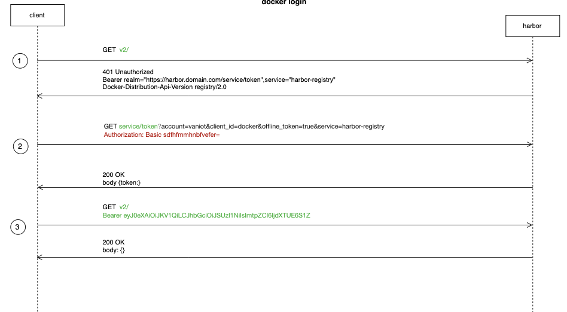
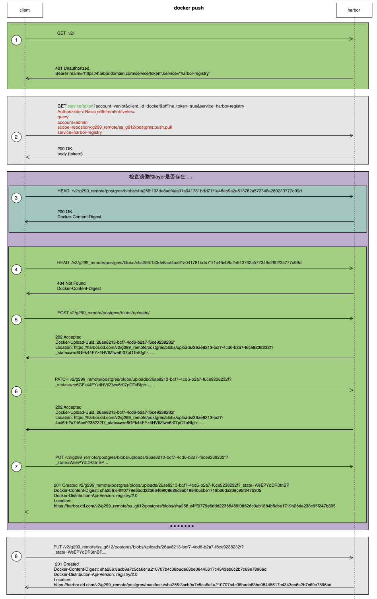

# Reverse Proxy Library

This Go library provides a reverse proxy implementation to handle requests and modify headers for a specified target domain.

## How It Works

The following diagram illustrates the flow of request/response between client, proxy, and target domain.

#### docker login



#### docker push



## Features

- Reverse proxy setup using `net/http/httputil`.
- Automatic header modification for `Www-Authenticate` and `Location`.
- TLS configuration to skip certificate verification (for testing purposes).

## Installation

To use this library, you need to have Go installed. You can get the library by running:

```bash
go get github.com/Firstnsnd/docker-proxy
```

## Usage
Import the package in your Go application:
```go
import "github.com/Firstnsnd/docker-proxy"
```
Create a new reverse proxy and start handling requests:

```go
package main

import (
	"github.com/Firstnsnd/docker-proxy"
	"log"
	"net/http"
)

var domain = "your_harbor_domain"

func main() {
	reverseProxy, err := proxy.NewReverseProxy(domain)
	if err != nil {
		log.Fatalf("Error creating reverse proxy: %v", err)
	}

	http.HandleFunc("/", reverseProxy.HandleRequest)

	log.Println("Starting proxy server on :8099")
	if err := http.ListenAndServe(":8099", nil); err != nil {
		log.Fatalf("Error starting server: %v", err)
	}
}
```

### Configuration
- Domain: Set the domain variable in your application to the target domain you want to proxy.
- TLS InsecureSkipVerify: Currently set to true for testing. Do not use this setting in production.

## Contributing
Feel free to submit issues or pull requests if you find any bugs or have suggestions for improvements.

## License 
This project is licensed under the MIT License.


